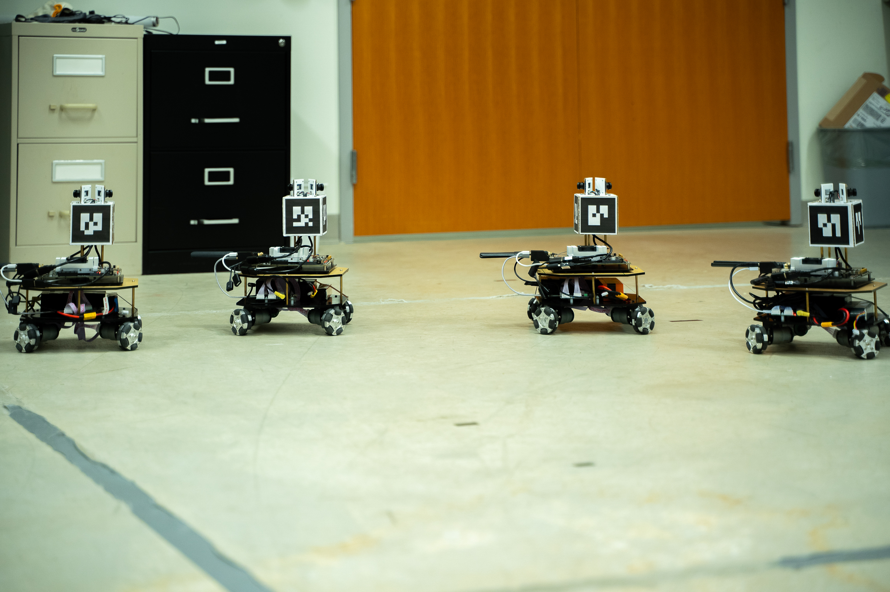

# robot_formation

Its a project of my master thesis.

## Overall 

The robots should form a designed formation pattern when moving with a desired direction and velocity,
meanwhile,the robots need keep other robots inside the visible zone. 

A video can be seen at [robot formation]( https://youtu.be/5x1tOIw7TJc)
